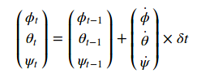

# FCND-P4-3D-Estimation
Udacity Flying Car Nanodegree - Project 4 - 3D Estimation

# Project description
In this project, we implement a 3D estimation technique for quadrotors using Extended Kalman Filter. This is build upon Project-3 [3D PID Controller](https://github.com/haragg2/FCND-Controls). All the maths used in the project can be found in [Estimation for Quadrotors](https://www.overleaf.com/read/vymfngphcccj#/54894644/). This estimator uses a IMU, GPS and a magnetometer for the measurements of the state including position, velocity and attitude.

## Setup ##

This project will continue to use the C++ development environment you set up in the Controls C++ project.

 1. Clone the repository
 ```
 git clone https://github.com/haragg2/FCND-Estimation.git
 ```
2. Build

 - Create a new directory for the build files:
```sh
cd FCND-Estimation-CPP
mkdir build
```

 - Navigate to the build directory and run `cmake` and then compile and build the code:

```sh
cd build
cmake ..
make
```

3. You should now be able to run the simulator with `./CPPEstSim`.

### Project Structure ###

For this project, you will be interacting with a few more files than before.

 - The Extended Kalman Filter for state estimation is implemented in `QuadEstimatorEKF.cpp`

 - Parameters for tuning the EKF are in the parameter file `QuadEstimatorEKF.txt`

 - The cascade PID control implemented in `QuadControl.cpp`
 
 - Parameters for the PID control code is in `QuadControlParams.txt`

## The Tasks ##

### Scenario 1: Sensor Noise ###
For the controls project, the simulator was working with a perfect set of sensors, meaning none of the sensors had any noise.  The first step to adding additional realism to the problem, and developing an estimator, is adding noise to the quad's sensors.

So in this scenario we are going to find the standard deviation of the measurement noise. The simulator will generate two files with GPS and IMU measurements. These files need to be processes to find the standard deviation of the sensor measurements. Here is a simple python script to do that.
```
import numpy as np
from numpy import genfromtxt
data = genfromtxt("Graph1.txt", delimiter=',', dtype=None)
samples = map(float, data[1:,1])
print(np.std(samples))
```
 
Once the resulted values are pluged in `MeasuredStdDev_GPSPosXY` and `MeasuredStdDev_AccelXY`into the top of `config/6_Sensornoise.txt` the standard deviation will capture roughlly 8% of the respective measurements (which is what we expect within +/- 1 sigma bound for a Gaussian noise model).


When the scenario is passing the test, you should see this line on the standard output:
```
PASS: ABS(Quad.GPS.X-Quad.Pos.X) was less than MeasuredStdDev_GPSPosXY for 71% of the time
PASS: ABS(Quad.IMU.AX-0.000000) was less than MeasuredStdDev_AccelXY for 68% of the time
```

### Scenario 2: Attitude Estimation ###
For this simulation, the only sensor used is the IMU and noise levels are set to 0. And we are going to do the attitude estimation with the help of a complementary filter using rate gyro measurements.
First, we need to find the roll, pitch and yaw derivates using the following non-linear equation:


Then we will use the Forward Euler Method to get the attitude from the gyro measurement.



The implementation of this integration is at [/src/QuadEstimatorEKF.cpp](./src/QuadEstimatorEKF.cpp#L103-L115) from line 103 to line 115. The standard output when this scenario passes:

```
PASS: ABS(Quad.Est.E.MaxEuler) was less than 0.100000 for at least 3.000000 seconds
```


### Scenario 3: Prediction Step ###

In this next step you will be implementing the prediction step of the EKF. We using IMU measurement as our control imput to do the prediction. After implementing the `PredictState()` functon the estimator state track the actual state, with only reasonably slow drift, as shown in the figure below:


This drift can be attributed to small integration error as for now we are using an ideal IMU.

Until now we have just predicted the mean of the state. But let's introduce a realistic IMU, one with noise and implement the covariance prediction using the process noise Q in `Predict()` function. We run the covariance prediction and tune the `QPosXYStd` and the `QVelXYStd` process parameters in `QuadEstimatorEKF.txt` to try to capture the magnitude of the error.


The different elements of the predict step are implemented at:

- `PredictState` method: [/src/QuadEstimatorEKF.cpp](./src/QuadEstimatorEKF.cpp#L182-L191) line 182 to line 191.
- `GetRbgPrime` method: [/src/QuadEstimatorEKF.cpp](./src/QuadEstimatorEKF.cpp#L218-L233) line 218 to line 233.
- `Predict` method: [/src/QuadEstimatorEKF.cpp](./src/QuadEstimatorEKF.cpp#L280-L288) line 280 to line 288.


### Scenario 4: Magnetometer Update ###

Up until now we've only used the accelerometer and gyro for our state estimation.  In this step, we will be adding the information from the magnetometer to improve filter's performance in estimating the vehicle's heading. Initially the he estimate yaw is drifting away from the real value. But after this update step there will be no drift. 


This is a simple step but we make sure to normalize the difference between your measured and estimated yaw (we don't want to update our yaw the long way around the circle)

Finally we tune the parameter `QYawStd` (`QuadEstimatorEKF.txt`) so that it approximately captures the magnitude of the error, as demonstrated here:


The magnetometer update is implemented at [/src/QuadEstimatorEKF.cpp](./src/QuadEstimatorEKF.cpp#L349-L354) line 349 to line 354. When the scenario is passing the test, you should see this line on the standard output:

```
PASS: ABS(Quad.Est.E.Yaw) was less than 0.120000 for at least 10.000000 seconds
PASS: ABS(Quad.Est.E.Yaw-0.000000) was less than Quad.Est.S.Yaw for 71% of the time
```


### Scenario 5: Closed Loop + GPS Update ###

Before implementing the GPS update step the position and velocity errors (bottom right) drifts away. And after we change to using our estimator by setting `Quad.UseIdealEstimator` to 0 in `config/11_GPSUpdate.txt` the drone goes wild from time to time as well:

Then we do GPS update uses the following jacobian: 


And tune the process noise model `QPosZStd` and the `QVelZStd` in `QuadEstimatorEKF.txt` to try to approximately capture the error you see with the estimated uncertainty (standard deviation) of the filter.

The objective is to complete the entire simulation cycle with estimated position error of < 1m (we’ll see a green box over the bottom graph if we succeed).


At this point, we have a working estimator!

```
PASS: ABS(Quad.Est.E.Pos) was less than 1.000000 for at least 20.000000 seconds
```

The GPS update was implemented at [/src/QuadEstimatorEKF.cpp](./src/QuadEstimatorEKF.cpp#L314-L326) line 314 to line 326. 

### Scenario 6: Adding Your Controller ###

Up to this point, we have been working with a controller that has been implemented in the last Controls project with same tuning parameters and it worked all fine.
